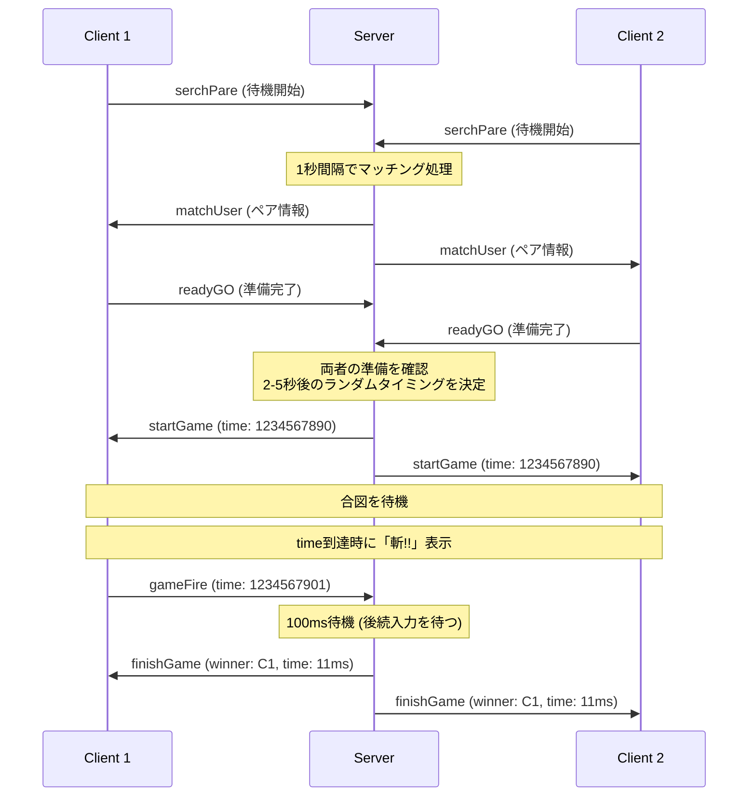
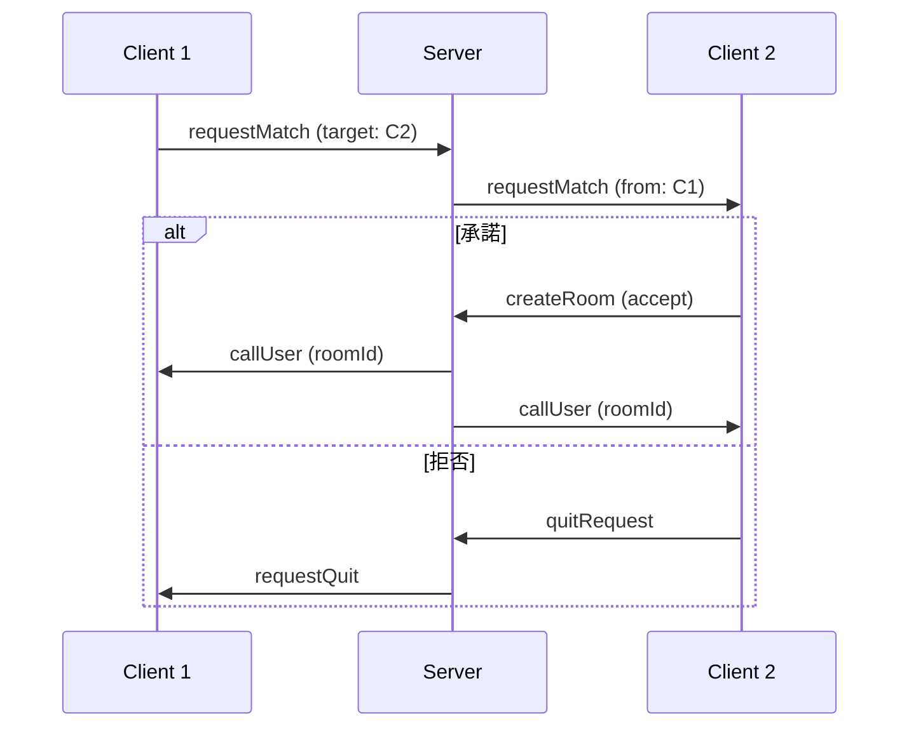

# 刹那の見斬り - リアルタイム対戦ゲーム


## 📖 プロジェクト概要

「刹那の見斬り」は、2人のプレイヤーがリアルタイムで対戦する反射神経ゲームです。ピンクの悪魔の「刹那の見斬り」をリスペクトし、WebSocketを使用した高速通信により、ミリ秒単位の精密な判定を実現しています。

### 🎮 ゲームコンセプト

- プレイヤー同士が画面をタップし、早く反応した方が勝利
- ランダムなタイミングで「斬!!」の合図が表示
- 合図前にタップするとフライング失格
- 40ms以内の同時タップは引き分け判定
- 再戦機能で連続対戦が可能

---

## 🌟 主な機能

### 対戦システム
- **ランダムマッチング**: 待機中のプレイヤーと自動マッチング
- **フレンドマッチ**: オンラインプレイヤーを選んで対戦申込
- **リアルタイム同期**: WebSocketによる低遅延通信
- **遅延補正**: クライアント-サーバー間の時間差を自動補正

### ユーザー体験
- **レスポンシブデザイン**: モバイル・デスクトップ対応
- **スムーズアニメーション**: CSS Transitionを活用
- **直感的UI**: Material-UIによる洗練されたインターフェース
- **リアルタイムステータス**: オンライン状態・対戦状況を即座に表示

---

## 🏗️ アーキテクチャ

### システム構成図

```
┌─────────────────────────────────────────────────────────────┐
│                         Nginx (Reverse Proxy)               │
│                            Port: 80                         │
└─────────────────┬───────────────────────────┬───────────────┘
                  │                           │
        ┌─────────▼─────────┐       ┌────────▼──────────┐
        │  React Client     │       │  WebSocket Server │
        │  (Static Files)   │       │    (Socket.io)    │
        │  Port: 3000       │       │    Port: 3030     │
        └───────────────────┘       └───────────────────┘
                  │                           │
                  └───────────┬───────────────┘
                              │
                    WebSocket Connection
                    (Real-time Bidirectional)
```

### 技術スタック

#### フロントエンド
| 技術 | バージョン | 用途 |
|-----|----------|------|
| **React** | 18.3.1 | UIフレームワーク |
| **TypeScript** | 4.9.5 | 型安全性の確保 |
| **Redux** | 4.0.5 | 状態管理 |
| **Socket.io-client** | 2.3.0 | WebSocket通信 |
| **Material-UI** | 4.9.9 | UIコンポーネント |
| **PixiJS** | 5.2.3 | 2Dグラフィックス描画 |
| **Sass** | 1.32.0 | スタイリング |

#### バックエンド
| 技術 | バージョン | 用途 |
|-----|----------|------|
| **Node.js** | - | サーバーランタイム |
| **Express** | 4.17.1 | Webフレームワーク |
| **Socket.io** | 2.3.0 | WebSocketサーバー |
| **TypeScript** | 3.8.3 | 型安全性の確保 |
| **Webpack** | 4.43.0 | バンドル管理 |

#### インフラ
| 技術 | 用途 |
|-----|------|
| **Docker** | コンテナ化 |
| **Docker Compose** | マルチコンテナ管理 |
| **Nginx** | リバースプロキシ・静的ファイル配信 |

---

## 📂 プロジェクト構造

```
setunanomikiritekina/
├── client/                      # React フロントエンド
│   ├── src/
│   │   ├── components/          # UIコンポーネント
│   │   │   ├── homeGame.tsx    # ホーム画面 (マッチング)
│   │   │   ├── playGame.tsx    # ゲームプレイ画面
│   │   │   ├── waitingGame.tsx # 待機画面
│   │   │   └── beforeGame.tsx  # ゲーム準備画面
│   │   ├── contexts/            # React Context
│   │   │   └── nameContext.ts  # グローバル状態管理
│   │   ├── reducer/             # Redux Reducers
│   │   │   ├── game.ts         # ゲーム状態
│   │   │   ├── socket.ts       # WebSocket状態
│   │   │   └── user.ts         # ユーザー情報
│   │   ├── actions/             # Redux Actions
│   │   │   ├── index.ts        # アクション定義
│   │   │   ├── gamePage.ts     # ページ遷移
│   │   │   └── socket.ts       # Socket通信
│   │   ├── plugins/             # プラグイン
│   │   │   └── socket.ts       # Socket.io クライアント設定
│   │   ├── css/                 # スタイルシート
│   │   ├── img/                 # 画像アセット
│   │   ├── App.tsx              # ルートコンポーネント
│   │   ├── Game.tsx             # ゲーム画面切り替え
│   │   └── index.tsx            # エントリーポイント
│   ├── public/                  # 静的ファイル
│   └── package.json
│
├── websocket/                   # WebSocket サーバー
│   ├── src/
│   │   ├── controllers/
│   │   │   ├── socketController.ts  # Socket イベントハンドラ
│   │   │   └── state.ts            # ゲーム状態管理クラス
│   │   └── index.ts                # サーバーエントリーポイント
│   ├── webpack/                 # Webpack設定
│   └── package.json
│
├── nginx/                       # Nginx設定
│   └── default.conf            # リバースプロキシ設定
│
├── Dockerfile_client           # クライアントビルド
├── Dockerfile_websocket        # サーバービルド
└── docker-compose.yml          # Docker構成
```

---

## 🎯 実装の特徴

### 1. 高精度タイミング同期

#### 遅延補正システム
```typescript
// client/src/plugins/socket.ts
// クライアント-サーバー間の時間差を計測
socket.emit('setTime', Date.now());
socket.on('timeLagSet', (lag: number) => {
  dispatch({ type: setlag, payload: lag });
});

// ゲームプレイ時に遅延を考慮
const now = Date.now() + state.game.lag;  // 補正された時刻
```

**技術的ポイント**:
- 接続時にping/pongで遅延を計測
- クライアントの時刻をサーバー時刻に同期
- ゲーム判定時に遅延を考慮した時刻を使用

#### 精密な勝敗判定
```typescript
// websocket/src/controllers/state.ts:174-209
timeFire(socketId: string, roomId: string, time: number) {
  const room: Room = this.rooms[roomId];
  const touchTime = time - room.time;
  const isDrawTime = Math.abs(room.touchTime - touchTime) < 40;  // 40ms以内は引き分け

  if (_.isUndefined(room.touchTime)) {
    room.touchTime = touchTime;
    room.win = socketId;
  }

  if (room.touchTime - touchTime > 0) {
    clearInterval(room.timeoutID);
    room.win = socketId;  // より早い方を勝者に更新
  }

  if (isDrawTime) {
    room.win = 'draw';
    // 引き分け処理
  } else {
    // 100ms後に結果確定（後続入力を待つ）
    room.timeoutID = setTimeout(() => {
      this.io.to(roomId).emit('finishGame', {
        socketId: room.win,
        time: room.touchTime,
      });
    }, 100);
  }
}
```

**技術的ポイント**:
- 最初のタップを記録し、100ms以内の後続入力を待つ
- より早いタップがあれば勝者を更新
- 40ms以内の差は引き分け判定
- タイムアウト処理で最終結果を確定

### 2. マッチングシステム

#### ランダムマッチング (1秒間隔でペアリング)
```typescript
// websocket/src/controllers/state.ts:39-67
startInterval() {
  // 待機中のプレイヤーを自動マッチング
  setInterval(() => {
    const waitUser = this.users.filter(
      (user: UserState) => user.type === 'waiting'
    );
    waitUser.length > 1 && this.pareCreate(waitUser);
  }, 1000);

  // 準備完了後にゲーム開始
  setInterval(() => {
    for (const room of Object.keys(this.rooms)) {
      if (this.rooms[room].user.every((user: UserState) => user.game.ready)) {
        const time = Date.now() + Math.floor(Math.random() * 3000) + 2000;
        this.startGame(this.rooms[room], time);
        // ...ルーム状態の初期化
      }
    }
  }, 1000);
}
```

**技術的ポイント**:
- 1秒ごとに待機プレイヤーをチェック
- 2人揃ったら自動でルーム作成
- 両者の準備完了を確認後、ランダムタイミング(2-5秒後)でゲーム開始

#### フレンドマッチング
```typescript
// client/src/components/homeGame.tsx:166-171
const requestMatch = (socketId: string) => {
  if (userState === "nomal") {
    requestedUser(socketId);
    wsUser.emit('requestMatch', { socketId: socketId, user: state.user });
  }
};

// websocket/src/controllers/socketController.ts:39-41
socket.on('requestMatch', ({ socketId, user }) => {
  socket.to(socketId).emit('requestMatch', user);
});
```

**技術的ポイント**:
- オンラインプレイヤーリストから対戦相手を選択
- 対戦申込・承諾/拒否のフロー
- 専用ルームの作成と管理

### 3. 状態管理

#### Redux + Context API のハイブリッド構成
```typescript
// client/src/contexts/nameContext.ts
export const NameContext = React.createContext<Context>(initialState);

export const NameProvider = (props: any) => {
  const [state, dispatch] = useReducer(rootReducer, initialState);
  return (
    <NameContext.Provider value={{ state, dispatch }}>
      {props.children}
    </NameContext.Provider>
  );
};
```

**状態の分類**:
- **game**: ゲーム進行状態、勝敗、タイミング情報
- **socket**: WebSocket接続状態、オンラインユーザー
- **user**: プレイヤー情報、Socket ID

### 4. リアルタイム通信

#### WebSocket イベント設計

**クライアント → サーバー**:
| イベント | 用途 |
|---------|------|
| `setname` | 名前とSocket IDの登録 |
| `toHome` | ホーム画面に戻る |
| `serchPare` | ランダムマッチング開始 |
| `requestMatch` | 対戦申込 |
| `quitRequest` | 申込キャンセル |
| `createRoom` | ルーム作成 |
| `readyGO` | ゲーム準備完了 |
| `gameFire` | ボタンタップ |
| `setTime` / `setlag` | 遅延計測 |

**サーバー → クライアント**:
| イベント | 用途 |
|---------|------|
| `connectUser` | Socket ID通知 |
| `NowonlineUser` | オンラインユーザー一覧 |
| `AddonlineUser` | 新規ユーザー追加通知 |
| `disConnect` | ユーザー切断通知 |
| `matchUser` | マッチング成立通知 |
| `callUser` | ルーム参加指示 |
| `startGame` | ゲーム開始合図 |
| `finishGame` | 勝敗結果通知 |
| `timeLagSet` | 遅延値通知 |

---

## 🚀 セットアップと起動

### 前提条件
- Docker Desktop インストール済み
- Git インストール済み

### インストール手順

```bash
# 1. リポジトリのクローン
git clone https://github.com/your-username/setunanomikiritekina.git
cd setunanomikiritekina

# 2. Dockerコンテナのビルドと起動
docker-compose up --build

# 3. ブラウザで開く
# http://localhost
```

### 開発環境での起動

```bash
# クライアント (別ターミナル)
cd client
npm install
npm start  # http://localhost:3000

# WebSocketサーバー (別ターミナル)
cd websocket
npm install
npm run dev  # http://localhost:3030
```

---

## 🎮 使い方

### 1. ユーザー登録
- 初回アクセス時に名前を入力
- 自動的にSocket IDが割り当てられる

### 2. マッチング方法

#### ランダムマッチング
1. ホーム画面で「ランダムマッチ」ボタンをクリック
2. 相手が見つかるまで待機
3. マッチング成立後、ゲーム準備画面に遷移

#### フレンドマッチング
1. 「Player」タブに切り替え
2. オンラインプレイヤーリストから対戦相手を選択
3. 「対戦を申し込む」ボタンをクリック
4. 相手が承諾するとゲーム開始

### 3. ゲームプレイ
1. 準備画面で「準備完了」を両者がクリック
2. 2〜5秒のランダムな待機時間
3. 「斬!!」の合図が表示されたら画面をタップ
4. 早くタップした方が勝利

### 4. 再戦
- 結果画面で「たたかう」ボタンで再戦
- 「やめる」ボタンでホームに戻る

---

## 🔧 技術的な工夫

### パフォーマンス最適化

#### 1. レンダリング最適化
```typescript
// useValueRef で最新の値を参照しつつ再レンダリングを回避
function useValueRef<T>(val: T) {
  const ref = React.useRef(val);
  React.useEffect(() => {
    ref.current = val;
  }, [val]);
  return ref;
}

// タイマー処理で使用
const fire = useValueRef(state.game.fire);
timer = setInterval(() => {
  if (!fire.current) {
    // 最新の値を参照
  }
}, 10);
```

#### 2. WebSocket接続の永続化
```typescript
// plugins/socket.ts - シングルトンパターンで接続を再利用
export const wsUser = connect();

// 各コンポーネントで同じ接続を使用
import { wsUser } from '../plugins/socket';
wsUser.emit('eventName', data);
```

#### 3. CSS Transitionによるアニメーション
```typescript
// ページ遷移にCSSトランジションを使用 (client/src/components/homeGame.tsx:78-94)
<SwitchTransition mode='out-in'>
  <CSSTransition
    classNames={value === 0 ? 'toRight' : 'toLeft'}
    in={value === 0}
    key={value}
    timeout={200}
    addEndListener={(node, done) =>
      node.addEventListener('transitionend', done, false)
    }
  >
    {/* コンポーネント */}
  </CSSTransition>
</SwitchTransition>
```

### セキュリティ

#### 1. クライアント時刻の検証
```typescript
// サーバー側でタイムスタンプを検証
timeFire(socketId: string, roomId: string, time: number) {
  const touchTime = time - room.time;
  // マイナス値やゲーム開始前のタップを無効化
  if (touchTime < 0) return;
  // ...
}
```

#### 2. ユーザー状態の管理
```typescript
// サーバー側でユーザー状態を管理し、不正な遷移を防止
update(socketId: string, type: string) {
  this.users.forEach((user: UserState) => {
    if (user.socketId === socketId) {
      user.type = type;
      this.onUpdate([user]);
    }
  });
}
```

### エラーハンドリング

#### 1. 切断時の処理
```typescript
// websocket/src/controllers/socketController.ts:30-33
socket.on('disconnect', () => {
  UserState.remove(socket.id);
  socket.broadcast.emit('disConnect', socket.id);
});

// クライアント側で自動的にユーザーリストから削除
socket.on('disConnect', (socketId: string) => {
  dispatch({ type: socketDisconnect, payload: socketId });
});
```

#### 2. 存在しないルームへのアクセス防止
```typescript
// websocket/src/controllers/state.ts:175-176
timeFire(socketId: string, roomId: string, time: number) {
  const room: Room = this.rooms[roomId];
  if (_.isUndefined(room)) return;  // 早期リターン
  // ...
}
```

---

## 📊 データフロー

### ゲーム開始までのフロー



### 対戦申込フロー



---

## 🧪 テストガイド

### 手動テスト手順

#### 1. マッチング機能
```bash
# 2つのブラウザウィンドウで同時にアクセス
# Window 1
1. 名前入力: "Player1"
2. ランダムマッチをクリック

# Window 2
1. 名前入力: "Player2"
2. ランダムマッチをクリック

# 期待結果: 両方でマッチング画面が表示される
```

#### 2. 遅延補正
```bash
# Chrome DevTools > Network > Throttling
1. "Slow 3G" に設定
2. ゲームをプレイ
3. 正常に判定されることを確認
```

#### 3. 引き分け判定
```bash
# 2つのウィンドウで「斬!!」表示と同時にクリック
# 期待結果: 引き分けになり、自動的に再戦が開始される
```

---

## 🐛 既知の問題と今後の改善

### 既知の問題
1. **接続断時のルーム残留**: 途中切断時にルームが残り続ける場合がある
2. **スケーラビリティ**: 単一サーバーのため、大規模な同時接続には未対応
3. **モバイルブラウザ**: タッチイベントのタイミングに若干の遅延

### 改善予定
- [ ] Redis等を使用したルーム情報の永続化
- [ ] マルチサーバー対応 (Socket.io Adapter)
- [ ] ランキング機能の実装
- [ ] リプレイ機能
- [ ] チャット機能
- [ ] モバイルアプリ化 (React Native)

---

## 📝 開発の学び

### 技術的な挑戦

#### 1. リアルタイム同期の精度
- WebSocketの双方向通信特性を活用
- クライアント-サーバー間の時刻同期ロジック
- ミリ秒単位の精密な判定処理

#### 2. 状態管理の設計
- Redux + Context APIのハイブリッド構成
- グローバル状態とローカル状態の使い分け
- イミュータブルな状態更新

#### 3. Docker環境の構築
- マルチコンテナアプリケーション
- Nginxによるリバースプロキシ設定
- 開発/本番環境の切り替え

### 得られた知見

1. **リアルタイム通信の設計パターン**
   - イベント駆動アーキテクチャ
   - ルームベースの接続管理
   - ブロードキャストとユニキャストの使い分け

2. **パフォーマンスチューニング**
   - 不要な再レンダリングの削減
   - WebSocket接続の再利用
   - CSSトランジションの活用

3. **UX設計**
   - レスポンシブなフィードバック
   - 待機時のローディング表示
   - エラー時の適切なメッセージング

---

## 👥 コントリビューション

このプロジェクトへの貢献を歓迎します！

### コントリビューションガイドライン
1. このリポジトリをフォーク
2. 新しいブランチを作成 (`git checkout -b feature/amazing-feature`)
3. 変更をコミット (`git commit -m 'Add some amazing feature'`)
4. ブランチにプッシュ (`git push origin feature/amazing-feature`)
5. プルリクエストを作成

---

## 📄 ライセンス

このプロジェクトはMITライセンスの下で公開されています。

---

## 📧 連絡先

プロジェクトに関する質問やフィードバックは、以下の方法でお気軽にお問い合わせください：

- GitHub Issues: [プロジェクトのIssuesページ](https://github.com/your-username/setunanomikiritekina/issues)
- Email: your.email@example.com

---

## 🙏 謝辞

- ゲームコンセプトのインスピレーション: ピンクの悪魔の「刹那の見斬り」
- UIコンポーネント: [Material-UI](https://material-ui.com/)
- WebSocket実装: [Socket.io](https://socket.io/)
- アイコン: [Material Icons](https://material.io/resources/icons/)

---

<div align="center">
Made with ❤️ and TypeScript
</div>
